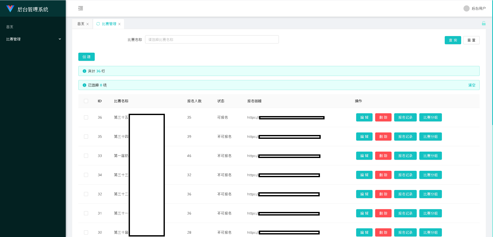

# AntOA
本项目是一个基于Vue Antd Admin[Vue Antd Admin](https://github.com/iczer/vue-antd-admin) 大刀阔斧地阉割并二次开发的面向 Laravel 后台开发者的后台管理系统框架，laravel开发者可以通过简单的配置轻松实现各种后台简单或稍显复杂的交互

[](https://github.com/similing4/AntOA/blob/master/LICENSE)
[](https://github.com/similing4/AntOA/releases/latest)

## 功能展示
```php
class RaceController extends AntOAController {
    public function __construct(AuthInterface $auth) {
        parent::__construct($auth);
    }

    /**
     * 初始化Grid对象
     * @param Grid $grid
     */
    public function grid(Grid $grid) {
        $sql = DB::table("race_register")
            ->groupBy("race_id")
            ->select(['race_id', DB::raw('count(id) as reg_count')])
            ->toSql();
        $chooseUser = (new GridListEasy(new class(DB::table("race_register")) extends DBListOperator {
            public function where($column, $operator = null, $value = null, $boolean = 'and') {
                if ($column == "id")
                    return parent::where("race_id", $operator, $value, $boolean);
                return parent::where($column, $operator, $value, $boolean);
            }
        }))->columnText("game_uid", "雀魂UID")
            ->columnText("game_nickname", "雀魂昵称")
            ->filterHidden('id');
        $grid->list((new class(DB::table("race as race")->leftJoin(DB::raw("(" . $sql . ") reg"), DB::raw('reg.race_id'), '=', 'race.id')) extends DBListOperator {
            public function where($column, $operator = null, $value = null, $boolean = 'and') {
                return parent::where("race." . $column, $operator, $value, $boolean);
            }

            public function select($columns) {
                $columns2 = [];
                foreach ($columns as $r) {
                    if ($r != "reg_count")
                        $columns2[] = "race." . $r . " as " . $r;
                    else
                        $columns2[] = DB::raw("reg.reg_count as reg_count");
                }
                return parent::select($columns2);
            }
        })->orderBy('start_time', "desc"))
            ->columnText('id', 'ID')
            ->columnText('name', '比赛名称')
            ->columnText('reg_count', '报名人数')
            ->columnEnum('status', '状态', [
                new EnumOption(0, "不可报名"),
                new EnumOption(1, "可报名")
            ])
            ->columnRichDisplay('detail_url', '报名链接')
            ->filterText("name", "比赛名称")
            ->rowNavigateButton(new class("/race/register/list", "报名记录", "primary") extends ListRowButtonNavigate {

                public function calcButtonParam(UrlParamCalculator $calculator) {
                    return [new UrlParamCalculatorParamItem("race_id", $calculator->getRowParamByKey("id")->val)];
                }

                public function judgeIsShow(UrlParamCalculator $calculator) {
                    return true;
                }
            })
            ->rowNavigateButton(new class("/race/group/list", "比赛分组", "primary") extends ListRowButtonNavigate {

                public function calcButtonParam(UrlParamCalculator $calculator) {
                    return [new UrlParamCalculatorParamItem("race_id", $calculator->getRowParamByKey("id")->val)];
                }

                public function judgeIsShow(UrlParamCalculator $calculator) {
                    return true;
                }
            });
        $grid->createForm(new class(DB::table("race")) extends DBCreateOperator {
        })
            ->columnText('name', '比赛名称')
            ->columnTimestamp('start_time', '比赛开始时间')
            ->columnTimestamp('register_end_time', '报名截止时间')
            ->columnRichText('money_explain', '奖金介绍')
            ->columnRichText('race_explain', '比赛简介')
            ->columnText('race_qq_number', '比赛QQ群')
            ->columnText('race_qq_url', '比赛QQ群加群链接')
            ->columnRadio('status', '状态', [
                new EnumOption("0", "不可报名"),
                new EnumOption("1", "可报名"),
            ]);
        $grid->editForm(new class(DB::table("race")) extends DBEditOperator {
        })
            ->columnHidden('id')
            ->columnText('name', '比赛名称')
            ->columnTimestamp('start_time', '比赛开始时间')
            ->columnTimestamp('register_end_time', '报名截止时间')
            ->columnRichText('money_explain', '奖金介绍')
            ->columnRichText('race_explain', '比赛简介')
            ->columnText('race_qq_number', '比赛QQ群')
            ->columnText('race_qq_url', '比赛QQ群加群链接')
            ->columnRadio('status', '状态', [
                new EnumOption("0", "不可报名"),
                new EnumOption("1", "可报名")
            ])
            ->columnChildrenChoose('winner1', '第一名（比赛结束后设置）', $chooseUser, "game_uid", "game_nickname")
            ->columnChildrenChoose('winner2', '第二名（比赛结束后设置）', $chooseUser, "game_uid", "game_nickname");
        $grid->hookList(new class() implements ListHook {
            public function hook($response) {
                foreach ($response['data'] as &$r) {
                    if (!$r['reg_count'])
                        $r['reg_count'] = 0;
                    $r['detail_url'] = url("/race?id=" . $r['id']);
                }
                return $response;
            }
        });
        $grid->hookDelete(new class() implements DeleteHook {
            public function hook($id) {
                if (DB::table("race_register")->where("race_id", $id)->count() > 0)
                    throw new Exception("该比赛已有人报名，不能删除");
                DB::table("race")->where("id", $id)->delete();
                return null;
            }
        });
    }

    /**
     * 处理统计数据
     * @param Request $req 客户端请求参数
     * @return string 统计结果
     */
    public function statistic(Request $req) {
        return "";
    }

    /**
     * 根据UID对控制器下所有接口进行鉴权
     * @param String $uid 用户UID
     * @return Boolean 返回真则验权通过，否则验权失败
     */
    protected function checkPower($uid) {
        return true;
    }
}
```

