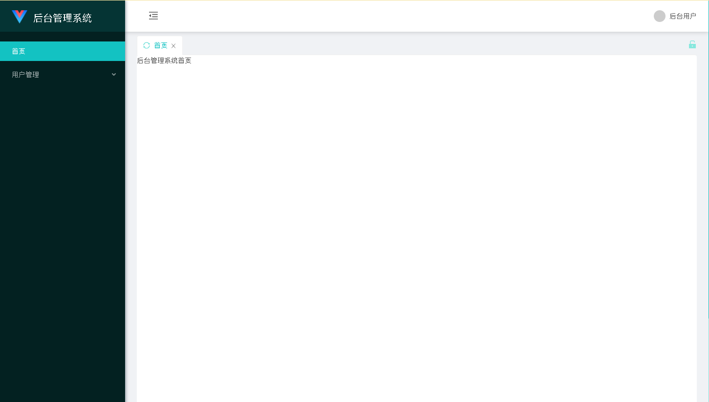
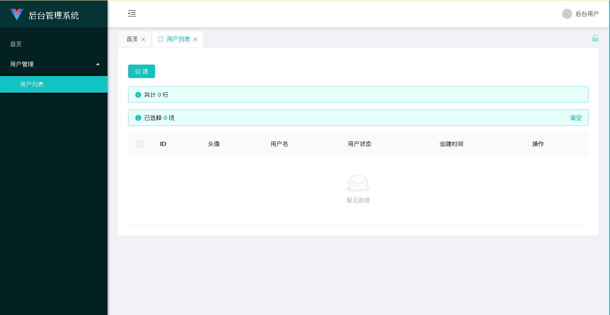
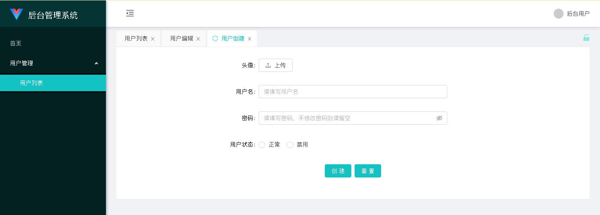
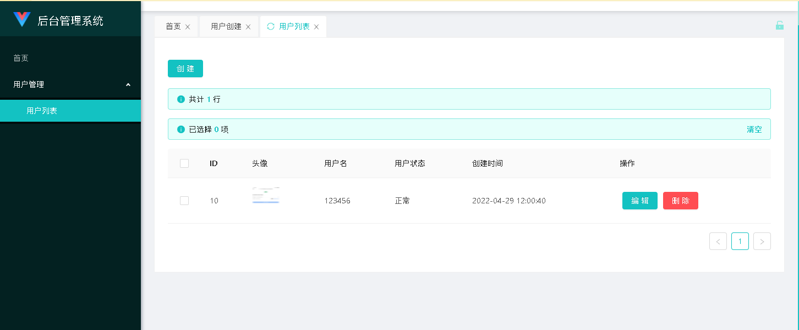

## 快速开发一个用户管理功能
初始安装部分详见 一、指南->安装与初始化配置

如果想开发一个对应实体（比如用户）的管理功能，你需要创建一个模块以实现功能，假设你要创建的模块名叫UserManagerModule，你可以在项目根目录下执行：

```bash
	php artisan module:make UserManagerModule
```

执行后会在项目的Modules文件夹下生成一个UserManagerModule模块。我们的代码编写就在这里开始。

我们需要在UserManagerModule\Http\Controller文件夹中创建一个控制器继承自AntOAController。我们现在需要做用户管理，因而我们可以创建一个UserController类，那么我们就创建一个UserController.php：

```php
<?php
namespace Modules\UserManagerModule\Http\Controllers;
use Illuminate\Http\Request;
use Illuminate\Support\Facades\DB;
use Modules\AntOA\Http\Controllers\AntOAController;
use Modules\AntOA\Http\Utils\AuthInterface;
use Modules\AntOA\Http\Utils\DBListOperator;
use Modules\AntOA\Http\Utils\Grid;
use Modules\AntOA\Http\Utils\Model\EnumOption;

class UserController extends AntOAController {
    public function __construct(AuthInterface $auth) { //这个构造方法不能省略
        parent::__construct($auth);
    }

    public function grid(Grid $grid) { //这里编写grid相关操作
    }

    public function statistic(Request $req) { //这里返回统计信息
        return "";
    }

    protected function checkPower($uid) { //检查是否满足访问该控制器的权限要求，如果用户未登录则不走该方法
        return true;
    }
}
?>
```

假设我们都用户表是user，用户表包含字段如下：

```sql
CREATE TABLE `user` (
 `id` int(10) unsigned NOT NULL AUTO_INCREMENT COMMENT 'ID',
 `user_icon` varchar(100) COLLATE utf8mb4_unicode_ci NOT NULL COMMENT '用户头像地址',
 `username` varchar(100) COLLATE utf8mb4_unicode_ci NOT NULL COMMENT '用户名',
 `password` varchar(32) COLLATE utf8mb4_unicode_ci NOT NULL COMMENT '密码',
 `status` tinyint(1) NOT NULL DEFAULT '1' COMMENT '状态（0正常1禁用）',
 `create_time` timestamp NOT NULL DEFAULT CURRENT_TIMESTAMP COMMENT '创建时间',
 PRIMARY KEY (`id`) USING BTREE
) ENGINE=MyISAM AUTO_INCREMENT=10 DEFAULT CHARSET=utf8mb4 COLLATE=utf8mb4_unicode_ci ROW_FORMAT=DYNAMIC
```

那么我们就可以像这样编写grid方法：

```php
<?php
namespace Modules\UserManagerModule\Http\Controllers;
use Illuminate\Http\Request;
use Illuminate\Support\Facades\DB;
use Modules\AntOA\Http\Controllers\AntOAController;
use Modules\AntOA\Http\Utils\AuthInterface;
use Modules\AntOA\Http\Utils\DBListOperator;
use Modules\AntOA\Http\Utils\DBCreateOperator;
use Modules\AntOA\Http\Utils\DBEditOperator;
use Modules\AntOA\Http\Utils\Grid;
use Modules\AntOA\Http\Utils\Model\EnumOption;

class UserController extends AntOAController {
    public function __construct(AuthInterface $auth) { //这个构造方法不能省略
        parent::__construct($auth);
    }

    public function grid(Grid $grid) { //这里编写grid相关操作
    	$grid->list(new class(DB::table("user")) extends DBListOperator {})
        	->columnText('id', 'ID')
        	->columnPicture('user_icon', '头像', 50, 50)
        	->columnText('username', '用户名')
        	->columnEnum('status', '用户状态', [
        		new EnumOption(0, "正常"),
        		new EnumOption(1, "禁用")
        	])
        	->columnText('create_time', '创建时间');
        $grid->createForm(new class(DB::table("user")) extends DBCreateOperator {
        })
            ->columnPicture('user_icon', '头像')
            ->columnText('username', '用户名')
            ->columnRadio('status', '用户状态', [
        		new EnumOption(0, "正常"),
        		new EnumOption(1, "禁用")
        	]);
        $grid->editForm(new class(DB::table("user")) extends DBEditOperator {
        })
            ->columnHidden('id')
            ->columnPicture('user_icon', '头像')
            ->columnText('username', '用户名')
            ->columnRadio('status', '用户状态', [
        		new EnumOption(0, "正常"),
        		new EnumOption(1, "禁用")
        	])
            ->columnTimestamp('create_time', '创建时间');
    }

    public function statistic(Request $req) { //这里返回统计信息
        return "";
    }

    protected function checkPower($uid) { //检查是否满足访问该控制器的权限要求，如果用户未登录则不走该方法
        return true;
    }
}
?>
```

定义结束后我们需要为这个管理功能添加对应的页面路由，并把功能集成到后台侧边栏中，那么我们需要修改模块UserManagerModule中的路由配置，即UserManagerModule\routes\api.php：
```
<?php
use Illuminate\Http\Request;
use Modules\AntOA\Http\Utils\RouteRegister;

RouteRegister::registerApi('/admin/user', 'UserController'); //这样就可以注册UserController相关的接口了
?>
```

然后我们需要把需要的页面加入到antoa.php配置文件中的menu_routes字段里：
```php
<?php
$roleFunc = function ($role) {
    return function ($user) use ($role) {
        return in_array($role, json_decode($user['role'], true));
    };
};
return [
    'name'        => 'AntOA',
    'menu_routes' => [
        [
            "name"   => "首页",
            "isHome" => true,
        ],
        [
            "name"       => "用户管理",
            "role_limit" => $roleFunc(1),
            "children"   => [
                [
                    "path"       => "/admin/user/list", //上面我们定义的/admin/user，相关的页面中包含list、create、edit三个页面，我们这里将list页面放到侧边栏
                    "name"       => "用户列表",
                    "role_limit" => $roleFunc(1)
                ],
                [
                    "visible"    => false, //创建页面和编辑页面不显示在侧边栏，但路由中包含这个页面，故而我们需要加入这一项
                    "path"       => "/admin/user/create",
                    "name"       => "用户创建",
                    "role_limit" => $roleFunc(1)
                ],
                [
                    "visible"    => false, //创建页面和编辑页面不显示在侧边栏，但路由中包含这个页面，故而我们需要加入这一项
                    "path"       => "/admin/user/edit",
                    "name"       => "用户编辑",
                    "role_limit" => $roleFunc(1)
                ]
            ]
        ]
    ],
    'config'      => [
        'qiniu' => [
            'access_key' => '', //这里需要配置你的七牛云信息，否则不能使用上传图片功能
            'secret_key' => '', //这里需要配置你的七牛云信息，否则不能使用上传图片功能
            'bucket'     => '', //这里需要配置你的七牛云信息，否则不能使用上传图片功能
            'url'        => ''  //这里需要配置你的七牛云信息，否则不能使用上传图片功能
        ]
    ]
];
?>
```

访问 http://你的域名/antoa/webpack/index.html 使用数据库表antoa_user表中的用户登录即可。默认帐户密码均为admin。

登录后如图所示：


选择左侧的用户列表后如图所示，这个页面就是我们配置好的页面啦：



