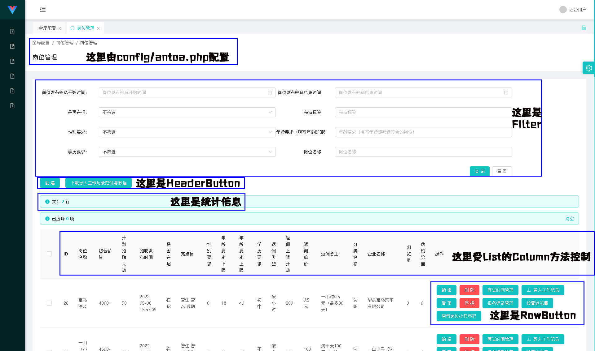

## GridList对象用法
首先我们看列表页的分块：

这里除了统计部分由控制器的statistic方法配置、面包屑部分由antoa/config.php配置外，其余部分均由GridList配置。

GridList配置需要在AntOAController的子类中的grid方法中配置。依然以UserController举例：
```
class UserController extends AntOAController {
    public function __construct(AuthInterface $auth) { //这个构造方法不能省略
        parent::__construct($auth);
    }

    public function grid(Grid $grid) {
    	//这里编写grid相关操作
    }

    public function statistic(Request $req) {
        return "";
    }

    protected function checkPower($uid) {
        return true;
    }
}
?>
```

## GridList对象的实例化
GridList对象需要由AntOAController的grid方法的$grid参数的list方法创建。该参数接收一个DBListOperator对象。你需要按照你的需求自行构造DBListOperator对象。例：
```
	function grid(Grid $grid) {
    	$grid->list(new class(DB::table("user")) extends DBListOperator{}); //这里参数是一个继承自DBListOperator的匿名对象，返回值是GridList对象。
    }
```
其中DBListOperator类属于Illuminate\Database\Query\Builder的扩展类，它的定义如下：
```
namespace Modules\AntOA\Http\Utils;
use Illuminate\Database\Query\Builder;
abstract class DBListOperator {
    public $builder; //DB类产生的对象，于构造方法中传入

    public function __construct(Builder $builder) {
        $this->builder = $builder;
    }

    public function doClone() {
        $ret = clone $this;
        $ret->builder = clone $this->builder;
        return $ret;
    }

    //where方法，设置的对应column会作为条件传入。你可以根据column自定义设置传入条件内容
    public function where($column, $operator = null, $value = null, $boolean = 'and') {
        $this->builder->where($column, $operator, $value, $boolean);
        return $this;
    }

    //whereIn方法，设置的对应column会作为条件传入。你可以根据column自定义设置传入条件内容
    public function whereIn($column, $values, $boolean = 'and', $not = false) {
        $this->builder->whereIn($column, $values, $boolean, $not);
        return $this;
    }

    //orderBy方法，你可以在这里自定义设置排序规则。
    public function orderBy($column, $direction) {
        $this->builder->orderBy($column, $direction);
        return $this;
    }

    //select方法，如果你有连接查询你可以在这里将查询字段格式化为正确的字段解决冲突。
    public function select($columns) {
        $this->builder->select($columns);
        return $this;
    }

    //分页方法，不建议直接重写本方法，建议直接通过hook修改结果。
    public function paginate($pageCount) {
        return $this->builder->paginate($pageCount);
    }

    //当编辑页或创建页使用column为COLUMN_CHILDREN_CHOOSE类型时，extra需要使用本方法。
    public function first() {
        return $this->builder->first();
    }

    //detail判断、删除时判断
    public function find($id) {
        return $this->builder->find($id);
    }

    //删除时进行的操作，除了重写这里之外，你也可以直接重写AntOAController的delete方法
    public function delete($id) {
        return $this->builder->delete($id);
    }
}
```
你可以在你的实体类中重写这个父类方法来实现你的各种功能。

## GridList对象的filter系列实例方法
filter系列方法用于列表页的筛选相关配置。该方法可以根据DBListOperator中查询的字段进行筛选。

## GridList对象的column系列实例方法
column系列方法用于列表页的表格的列的配置。该方法可以将DBListOperator中对应的查询字段通过一定的变化展示到页面上。

**注：下列内容中提到的“数据库”均指的是DBListOperator实例指定的查询结果。**

### public function column($column);
column的通用方法
#### 参数：
* $column 任意ListTableColumnBase子类的实例。所有继承自该类的实例均以ListTableColumn开头，且均定义于AntOA/Http/Utils/Model下。可用的实例如下：
	- ListTableColumnDisplay 只用于展示，需要通过hook方法配置其值，默认没有值。
	- ListTableColumnDivideNumber 用于将数据库行中指定列的查询结果以数字除以固定数值展示。如将金额（单位分）100转换为1元展示。
	- ListTableColumnEnum 用于将数据库行中指定列根据提供的字典翻译为对应的展示内容。如0为禁用1为启用，查询结果为0时就展示禁用。
	- ListTableColumnHidden 用于查询数据库指定列，但不在页面上展示
	- ListTableColumnPicture 用于将数据库行中指定列作为图片地址输出为图片在表内展示。
	- ListTableColumnRichDisplay 只用于展示富文本内容，需要通过hook方法配置其值，默认没有值
	- ListTableColumnRichText 用于数据库行中指定列作为富文本内容输出。
	- ListTableColumnText 用于将数据库行中指定列作为普通文本内容输出。
#### 返回值：
返回this供链式调用

### public function columnText($col, $colTip);
用于将数据库行中指定列作为普通文本内容输出。
#### 参数：
* $col 数据库对应的字段名。
* $colTip 提示内容
#### 返回值：
返回this供链式调用

### public function columnDisplay($col, $colTip);
只用于展示，需要通过hook方法配置其值，默认没有值。
#### 参数：
* $col 查询结果中对应的字段名。
* $colTip 提示内容
#### 返回值：
返回this供链式调用

### public function columnRichDisplay($col, $colTip);
只用于展示富文本内容，需要通过hook方法配置其值，默认没有值
#### 参数：
* $col 查询结果中对应的字段名。
* $colTip 提示内容
#### 返回值：
返回this供链式调用

### public function columnPicture($col, $colTip, $width, $height);
用于将数据库行中指定列作为图片地址输出为图片在表内展示。
#### 参数：
* $col 数据库对应的字段名。
* $colTip 提示内容
#### 返回值：
返回this供链式调用

### public function columnEnum($col, $colTip, array $options);
用于将数据库行中指定列根据提供的字典翻译为对应的展示内容。如0为禁用1为启用，查询结果为0时就展示禁用。
#### 参数：
* $col 数据库对应的字段名。
* $colTip 提示内容
* $options EnumOpiton对象的数组
#### 返回值：
返回this供链式调用
#### 范例：
```
$gridList->columnEnum("status","状态", [
	new EnumOpiton("0", "禁用"),
	new EnumOpiton("1", "启用")
]);
```

### public function columnRichText($col, $colTip);
用于数据库行中指定列作为富文本内容输出。
#### 参数：
* $col 数据库对应的字段名。
* $colTip 提示内容
#### 返回值：
返回this供链式调用

### public function columnHidden($col);
用于查询数据库指定列，但不在页面上展示。
#### 参数：
* $col 数据库对应的字段名。
#### 返回值：
返回this供链式调用

### public function columnDivideNumber($col, $colTip, $divide, $unit = '');
用于将数据库行中指定列的查询结果以数字除以固定数值展示。如将金额（单位分）100转换为1元展示。
#### 参数：
* $col 数据库对应的字段名。
* $colTip 提示内容
* $divide 被除数（如100分转为1元应传100）
* $unit 单位，默认为空（如100转为1元应传入“元”）
#### 返回值：
返回this供链式调用